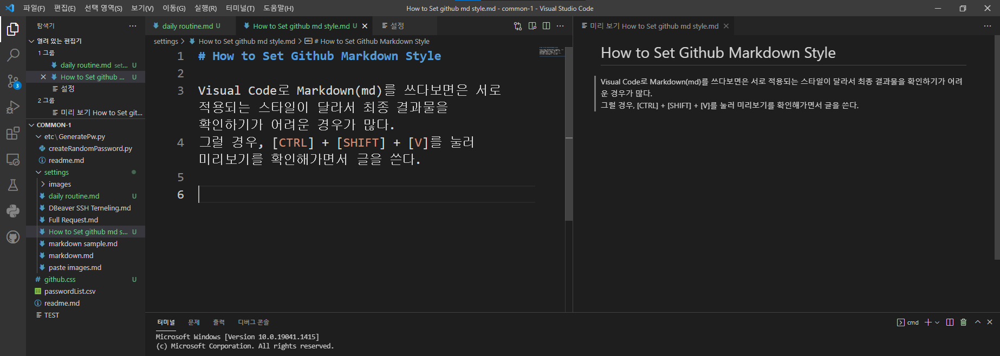
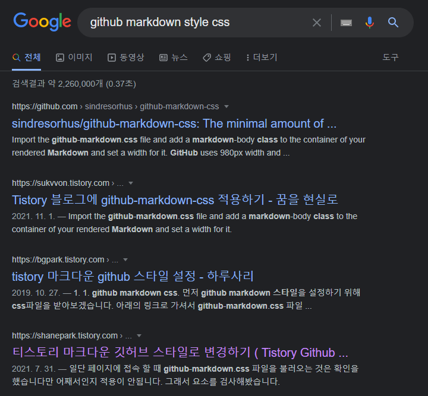
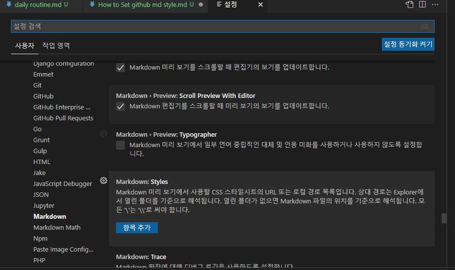
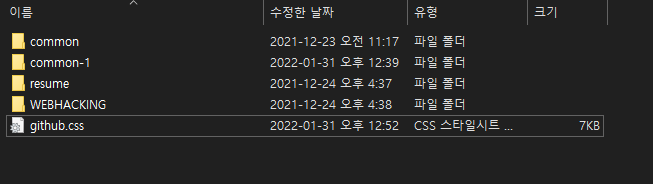
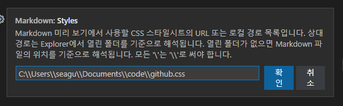

# How to Set Github Markdown Style in Visual Studio Code

Visual Code로 Markdown(md)를 쓰다보면은 서로 적용되는 스타일이 달라서 최종 결과물을 확인하기가 어려운 경우가 많다.  
그럴 경우, [CTRL] + [SHIFT] + [V]를 눌러 미리보기를 확인해가면서 글을 쓴다.  
 
 

## 일반적인 경우의 편집 환경
---
  
작성 창에서 왼쪽이 작성화면이고 오른쪽이 미리보기 화면이다.
그러나 왼쪽의 양식이 결과물이 올라가는 github와 양식이 달라서 약간은 불편하다.
 
 

## Order 
1. Download github markdown css file
2. Set visual code settings

## 1. Download github markdown css file
실제 깃허브의 css 파일은 위치를 잘 모르겠고 인터넷에 검색해서 최상단에 나오는 걸 사용했다.

 
css 파일 위치 : https://github.com/sindresorhus/github-markdown-css

## 2. Set visual code settings
  
설정 창을 열어서 
[파일] > [기본 설정] > [설정] > [확장] > [Markdown] > [Styles]   
또는 [Ctrl] + [,] > [확장] > [Markdown] > [Styles]
을 접속해서 css 파일을 정해준다.

! 나의 경우에는 프로젝트를 2~3개 정로 한번에 쓰기 때문에 상대경로로 하면은 적용이 안되는 귀찮은 경우를 많이 봤다.   
그러므로 내가 사용하는 git의 절대 경로를 짚어주는게 편할 것 같다.   
내 root folder는 문서에 있으므로 절대경로를 박아준다. > 어? 안돼네? 나중에 하는 걸로

1. css 파일을 일단 경로로 옮겨준다.  

1. 설정 경로를 정해준다.  

